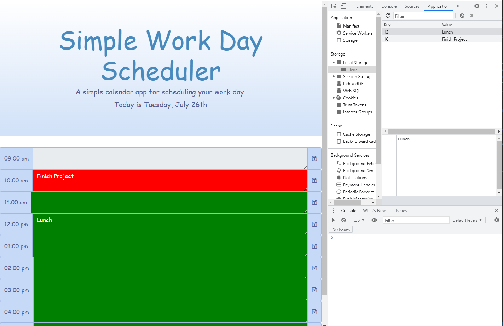

# Calendar-Day-Scheduler

## Table of Contents
- [Description](#description)
- [screenshot](#screenshot)

## Description
Create a daily scheduler that will allow the user to input a task on the current day at anytime and have the information saved into localstorage.
At the top of the screen is displayed what the date and day of the week it is. The current time slot is displayed in red,
the future time slots are displayed in green, and previous time slots display in grey. The user is not able to write any tasks that are previous time slots according to the current time.

## Screenshot
---

## Deployed URL Link
---
https://dmerk2.github.io/Calendar-Day-Scheduler/

© 2022 Daniel Merkin